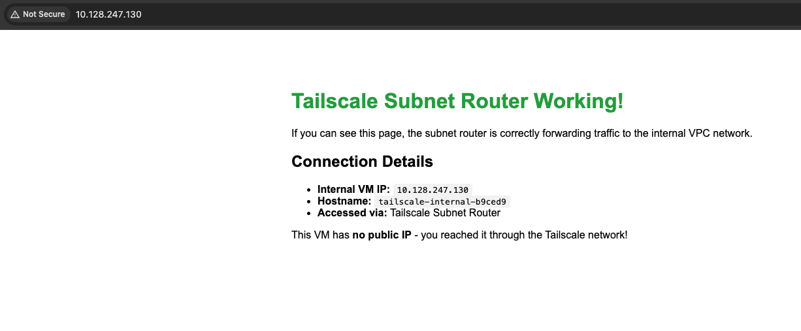

<div align="center">
  <a href="https://nirvanalabs.io">
    
  </a>

  [Sign Up](https://nirvanalabs.io/sign-up) · [Docs](https://docs.nirvanalabs.io) · [API](https://docs.nirvanalabs.io/api) · [Examples](https://github.com/nirvana-labs-examples) · [Terraform](https://registry.terraform.io/providers/nirvana-labs/nirvana/latest) · [TypeScript SDK](https://www.npmjs.com/package/@nirvana-labs/nirvana) · [Go SDK](https://github.com/Nirvana-Labs/nirvana-go) · [CLI](https://github.com/nirvana-labs/nirvana-cli) · [MCP](https://www.npmjs.com/package/@nirvana-labs/nirvana-mcp)
</div>

---

# Tailscale Subnet Router on Nirvana Labs

Terraform & Ansible example for deploying a Tailscale subnet router that provides access to a Nirvana VPC from any device on your Tailscale network.



## Architecture

```
+---------------------------------------------------------------------+
|                      Nirvana VPC (10.x.x.x/24)                      |
|                                                                     |
|  +---------------------------+    +---------------------------+     |
|  |    Tailscale Router       |    |      Internal VM          |     |
|  |    (Public IP)            |    |      (Private IP only)    |     |
|  |                           |    |                           |     |
|  |    - Subnet Router        |<-->|      - nginx test page    |     |
|  |    - Advertises VPC CIDR  |    |      - No public access   |     |
|  |    - IP Forwarding        |    |                           |     |
|  +--------------+------------+    +---------------------------+     |
|                 |                              ^                    |
+-----------------|-----------------------------|--------------------+
                  |                             |
                  | Tailscale                   | Via Subnet Router
                  | Network                     |
                  v                             |
          +---------------+                     |
          |  Your Device  |---------------------+
          |  (Tailscale)  |
          |               |--> Access internal VMs by private IP
          +---------------+--> No VPN client config needed
```

## How It Works

1. **Subnet Router** connects to both the Nirvana VPC and Tailscale network
2. **Routes are advertised** to Tailscale (the VPC CIDR block)
3. **After approval** in Tailscale admin, any Tailscale device can reach VPC resources
4. **Internal VM** has no public IP but is accessible via Tailscale

## Prerequisites

- [Terraform](https://www.terraform.io/downloads.html) >= 1.0
- [Ansible](https://docs.ansible.com/ansible/latest/installation_guide/intro_installation.html) >= 2.9
- [Nirvana Labs API Key](https://console.nirvanalabs.io)
- [Tailscale Account](https://tailscale.com) with an auth key
- SSH key pair

## Quick Start

### 1. Get a Tailscale Auth Key

1. Go to [Tailscale Admin Console](https://login.tailscale.com/admin/settings/keys)
2. Generate a new auth key (reusable recommended)
3. Save it for later

### 2. Configure Terraform

```bash
cd terraform

cat > terraform.tfvars << EOF
project_id     = "your-project-id"
ssh_public_key = "ssh-ed25519 AAAA... user@host"
EOF

export NIRVANA_LABS_API_KEY="your-api-key"
```

### 3. Deploy Infrastructure

```bash
terraform init
terraform apply
```

### 4. Generate Ansible Inventory

```bash
cd ..
chmod +x scripts/generate-inventory.sh
./scripts/generate-inventory.sh
```

### 5. Run Ansible Playbook

```bash
export TAILSCALE_AUTHKEY="tskey-auth-xxxxx"
cd ansible
ansible-playbook playbook.yml
```

### 6. Approve Subnet Routes

1. Go to [Tailscale Machines](https://login.tailscale.com/admin/machines)
2. Find the router machine
3. Click **Edit route settings**
4. Enable the advertised subnet route

### 7. Test Access

From any device on your Tailscale network:

```bash
# Access internal VM's web page
curl http://<INTERNAL_PRIVATE_IP>

# SSH to internal VM (no public IP!)
ssh ubuntu@<INTERNAL_PRIVATE_IP>
```

## Configuration

### Ansible Variables

| Variable | Description |
|----------|-------------|
| `TAILSCALE_AUTHKEY` | Tailscale auth key (env variable) |

### Terraform Variables

| Variable | Default | Description |
|----------|---------|-------------|
| `instance_type` | `n1-standard-2` | VM instance type |
| `boot_volume_size` | `64` | Boot volume size in GB |
| `vm_name_prefix` | `tailscale` | Prefix for VM names |

## What Gets Deployed

| Resource | Description |
|----------|-------------|
| VPC | Private network for both VMs |
| Router VM | Public IP, runs Tailscale subnet router |
| Internal VM | Private IP only, runs nginx test page |
| Firewall Rules | SSH, internal traffic, Tailscale UDP |

## Ports

| Port | Protocol | Service |
|------|----------|---------|
| 22 | TCP | SSH (router only from internet) |
| 80 | TCP | nginx (internal VM, via Tailscale) |
| 41641 | UDP | Tailscale direct connections |

## Verification

After setup, verify the subnet router is working:

```bash
# On your Tailscale-connected device
# 1. Check you can reach the internal VM
curl http://<INTERNAL_PRIVATE_IP>

# 2. You should see: "Tailscale Subnet Router Working!"

# 3. SSH works too (internal VM has no public IP!)
ssh ubuntu@<INTERNAL_PRIVATE_IP>
```

## Cleanup

```bash
cd terraform
terraform destroy
```

Don't forget to remove the machine from your Tailscale admin console.

## Security Notes

- The internal VM has **no public IP** - only accessible via Tailscale
- Tailscale provides end-to-end encryption
- Subnet routes require explicit approval in admin console
- Consider using [Tailscale ACLs](https://tailscale.com/kb/1018/acls/) for fine-grained access control

## Resources

- [Tailscale Subnet Routers](https://tailscale.com/kb/1019/subnets/)
- [Tailscale Auth Keys](https://tailscale.com/kb/1085/auth-keys/)
- [Tailscale ACLs](https://tailscale.com/kb/1018/acls/)
- [Nirvana Labs Documentation](https://docs.nirvanalabs.io)

## License

Apache 2.0 — see [LICENSE](LICENSE.md).
